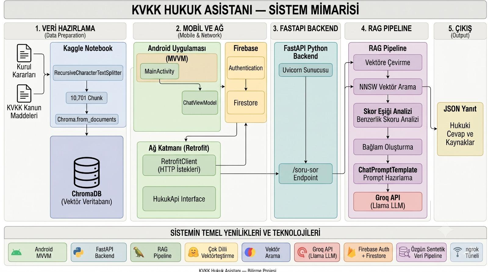

⚖️ KVKK Hukuk Asistanı API

  

KVKK Hukuk Asistanı API, Retrieval-Augmented Generation (RAG) mimarisi kullanılarak geliştirilmiş bir hukuk asistanı servisidir.

Projenin temel amacı, kullanıcıların Kişisel Verilerin Korunması Kanunu (KVKK) ve ilgili hukuki süreçler hakkında daha güvenilir bilgilere erişebilmesini sağlamaktır. Sistem, resmi KVKK mevzuatı ve KVKK Kurul kararlarından oluşturulan bilgi tabanını kullanarak bağlam destekli cevaplar üretir.

📱 İlişkili Projeler

Bu repository, çok katmanlı KVKK Hukuk Asistanı sisteminin backend servis katmanını içermektedir. Sistem; Android istemcisi, FastAPI tabanlı API servisi, ChromaDB vektör veritabanı ve Groq üzerinde çalışan büyük dil modeli entegrasyonundan oluşmaktadır.
 Sistemin Android istemci uygulaması aşağıdaki repository içerisinde geliştirilmektedir:

- Android Uygulaması: [KVKK Hukuk Asistanı Mobile](https://github.com/emirsz/HukukAsistan)

Backend ve mobil uygulama birlikte çalışarak kullanıcılara yapay zekâ destekli hukuk danışma deneyimi sunmaktadır.

🚀 Temel Özellikler

*RAG (Retrieval-Augmented Generation) mimarisi
*KVKK mevzuatı ve KVKK Kurul kararları tabanlı bilgi erişimi
*ChromaDB ile semantik benzerlik araması
*LangChain tabanlı LLM orkestrasyonu
*Groq Cloud üzerinden Llama 3.3 70B entegrasyonu
*Türkçe destekli çok dilli embedding modeli
*Kaynak bağlantılarıyla desteklenen cevaplar
*FastAPI tabanlı REST API
*Android mobil uygulama entegrasyonu
*Hukuk dışı sorular için alan sınırlandırması

🏗️ Sistem Mimarisi

Android Uygulaması
        │
        │ HTTPS POST
        ▼
FastAPI API
        │
        ▼
Kullanıcı Sorusu
        │
        ▼
Embedding Oluşturma
        │
        ▼
ChromaDB Similarity Search
        │
        ▼
İlgili KVKK Dokümanları
        │
        ▼
Prompt Oluşturma
        │
        ▼
Llama 3.3 70B (Groq)
        │
        ▼
Bağlam Destekli Hukuki Yanıt
        │
        ▼
Android Uygulaması

🧠 Kullanılan Teknolojiler

| Teknoloji              | Amaç                 |
| ---------------------- | -------------------- |
| FastAPI                | REST API Servisi     |
| Uvicorn                | ASGI Sunucusu        |
| LangChain              | LLM Orkestrasyonu    |
| ChromaDB               | Vektör Veritabanı    |
| HuggingFace Embeddings | Metin Vektörleştirme |
| Groq Cloud             | LLM Servisi          |
| Pydantic               | Veri Doğrulama       |
| python-dotenv          | Ortam Değişkenleri   |

🤖 Yapay Zekâ Bileşenleri
| Bileşen              | Teknoloji                                                   |
| -------------------- | ----------------------------------------------------------- |
| Embedding Modeli     | sentence-transformers/paraphrase-multilingual-MiniLM-L12-v2 |
| Vektör Veritabanı    | ChromaDB                                                    |
| LLM Sağlayıcısı      | Groq Cloud                                                  |
| Dil Modeli           | llama-3.3-70b-versatile                                     |
| Orkestrasyon Katmanı | LangChain                                                   |
| API Katmanı          | FastAPI                                                     |

📚 Bilgi Tabanı

Sistemin bilgi tabanı aşağıdaki resmi kaynaklardan oluşturulmuştur:
*KVKK Kanun Maddeleri
*KVKK Kurul Kararları

Veri mühendisliği sürecinde:
1.Ham hukuk verileri JSON formatında hazırlanmıştır.
2.Dokümanlar anlamsal bütünlüğü koruyacak şekilde parçalara ayrılmıştır.
3.Her parça embedding modeline dönüştürülmüştür.
4.Vektörler ChromaDB üzerinde indekslenmiştir.

⬇️ Veri Seti

Bu projede kullanılan veri setinin işlenmemiş ve işlenmiş sürümlerine aşağıdaki Kaggle bağlantısı üzerinden erişilebilir:

Kaggle Dataset:
https://www.kaggle.com/datasets/gamzekizil/lawdataset

Veri seti;
*KVKK Kanun Maddeleri
*KVKK Kurul Kararları
*Kaynak bağlantıları
*Yapısal JSON verileri
içermektedir.

Vektör veritabanı oluşturulurken bu veri seti anlamsal parçalara ayrılmış ve embedding işleminden geçirilmiştir.

Veri İstatistikleri:

| Özellik             | Değer                                 |
| ------------------- | ------------------------------------- |
| Embedding Modeli    | paraphrase-multilingual-MiniLM-L12-v2 |
| Toplam Chunk Sayısı | 10.701                                |
| Vektör Veritabanı   | ChromaDB                              |
| Arama Türü          | Similarity Search                     |
| Arama Sonucu Sayısı | İlk 5 En Yakın Komşu (k=5)            |

🔍 RAG İş Akışı

API'ye gelen her soru için aşağıdaki süreç uygulanır:
1.Kullanıcı sorusu embedding uzayında temsil edilir.
2.ChromaDB üzerinde benzerlik araması gerçekleştirilir.
3.En alakalı 5 doküman parçası alınır.
4.Dokümanlar prompt içerisine bağlam olarak eklenir.
5.Llama 3.3 modeli bağlamı kullanarak yanıt üretir.
6.Kullanılan kaynak bağlantıları API çıktısına eklenir.

📊 Benzerlik Skoru Analizi

Sistem, ChromaDB tarafından döndürülen benzerlik skorlarını yorumlayarak yanıtın bilgi tabanıyla ilişkisini analiz eder.

| Skor Aralığı | Değerlendirme                |
| ------------ | ---------------------------- |
| < 6.0        | Güçlü eşleşme                |
| 6.0 - 9.0    | Zayıf / Anlamsal eşleşme     |
| > 9.0        | Bilgi tabanıyla düşük ilişki |

Bu eşikler sistemin hata ayıklama ve karar destek mekanizmasının bir parçası olarak kullanılmaktadır.

🛡️ Alan Sınırlandırması

Sistem prompt seviyesinde hukuk alanına sınırlandırılmıştır.
Amaç:
*Hukuk dışı soruların cevaplanmaması
*Modelin konu dışına çıkmasının azaltılması
*Daha tutarlı ve güvenilir cevaplar üretilmesi

Hukuk dışı bir soru algılandığında sistem kullanıcıyı uygun şekilde bilgilendirir.

📡 API Dokümantasyonu

Endpoint (http):
POST /soru-sor

Request (JSON):
{
  "soru_metni": "KVKK kapsamında kişisel veri nedir?"
}

Response (JSON):
{
  "cevap": "Kişisel veri, kimliği belirli veya belirlenebilir gerçek kişiye ilişkin her türlü bilgidir.",
  "kaynaklar": [
    "https://..."
  ],
  "debug": {
    "veritabanindan_mi": true,
    "en_iyi_skor": 2.1843,
    "bulunan_chunklar": [
      {
        "sira": 1,
        "kaynak": "KVKK Madde 3",
        "benzerlik_skoru": 2.1843,
        "metin_ozeti": "...",
        "link": "https://..."
      }
    ]
  }
}

⚙️ Kurulum

1. Repoyu Klonlayın

git clone https://github.com/GamzeKizill/asistan_kvkk_backend.git
cd asistan_kvkk_backend

2. Sanal Ortam Oluşturun

Windows:
python -m venv venv
venv\Scripts\activate

Linux / macOS:
python -m venv venv
source venv/bin/activate

3. Bağımlılıkları Kurun

pip install -r requirements.txt

4. Ortam Değişkenlerini Yapılandırın

Kök dizinde bulunan .env.example dosyasını .env olarak yeniden adlandırın ve kendi Groq API anahtarınızı ekleyin.

GROQ_API_KEY=your_groq_api_key

5. Sunucuyu Başlatın

python main.py

🌐 Yerel Erişim

API varsayılan olarak aşağıdaki adreste çalışır:

http://localhost:8000

FastAPI Swagger arayüzü:

http://localhost:8000/docs

🌍 Dış Ağ Erişimi (Opsiyonel)

Mobil cihazlar veya farklı ağlar üzerinden erişim sağlamak için ngrok kullanılabilir.

Örnek kullanım:
ngrok http 8000

Özel alan adı kullanılıyorsa:
ngrok http 8000 --domain=YOUR_DOMAIN.ngrok-free.app

Ngrok tarafından oluşturulan HTTPS adresi mobil uygulamanın API adresi olarak kullanılabilir.

📂 Proje Yapısı

asistan_kvkk_backend
│
├── assets
├── kvkk_chroma_db_v2/
├── main.py
├── requirements.txt
├── .env.example
├── .gitignore
└── README.md

⚠️ Sorumluluk Reddi

Bu proje eğitim ve bilgilendirme amacıyla geliştirilmiştir. Üretilen yanıtlar hukuki danışmanlık hizmeti yerine geçmez. Somut hukuki uyuşmazlıklarda alanında uzman bir hukukçudan veya avukattan profesyonel destek alınmalıdır.

👨‍💻 Geliştirici

Karadeniz Teknik Üniversitesi Bilgisayar Mühendisliği öğrencileri Gamze Kızıl, Emir Söylemez ve Kübra Atlan tarafından geliştirilmiştir.